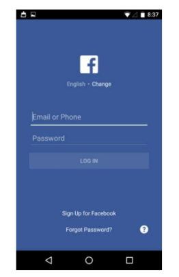

## Facebook Login Layout



## How to clone project?

### Prerequisites
Make sure you already have Android Studio IDE and Git.

1. Git
```bash
https://git-scm.com/
```
2. Android Studio IDE
```bash
https://developer.android.com/studio
```

### Clone project
1. Open Android Studio
2. Click `Get from VSC` button on the upper-right corner
3. Copy the URL field
```bash
https://github.com/phunlh2001/Facebook-Login-Clone.git
```
3. Click clone and Enjoy!!